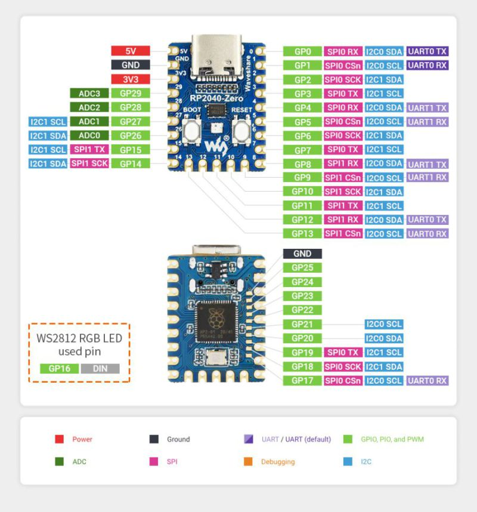
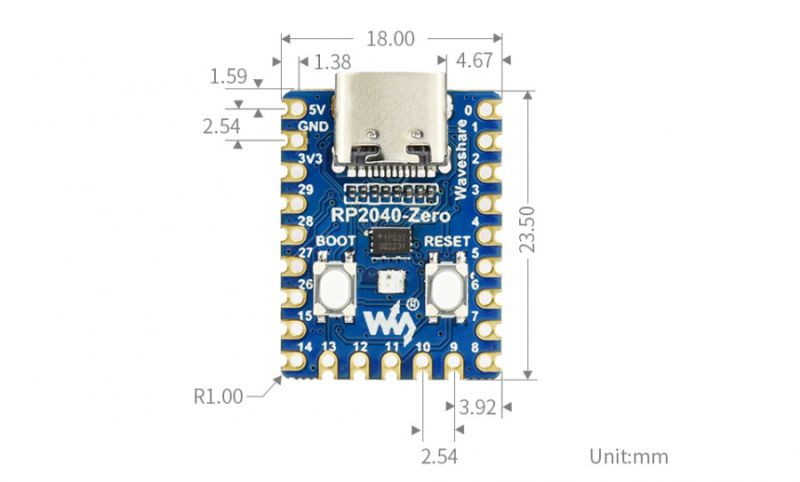

# RP2040 Zero PlatformIO Starter Pack# RP2040 Zero PlatformIO Starter Pack


> A ready-to-go workspace for the Waveshare RP2040 Zero that combines PlatformIO, Arduino, FastLED, and practical buying guidance.> A ready-to-go workspace for the Waveshare RP2040 Zero that combines PlatformIO, Arduino, FastLED, and practical buying guidance.


## Highlights## Highlights

- Pre-configured PlatformIO project with multiple upload targets.- Pre-configured PlatformIO project with multiple upload targets.

- Serial banner that surfaces the project repository URL for future reference.- Serial banner that surfaces the project repository URL for future reference.

- On-board LED and NeoPixel heartbeat to confirm the board is alive after flashing.- On-board LED and NeoPixel heartbeat to confirm the board is alive after flashing.

- Embedded pinout and mechanical reference images for quick lookup.- Embedded pinout and mechanical reference images for quick lookup.


## Quick Start## Quick Start

1. Install [PlatformIO](https://platformio.org/install) (VS Code extension or CLI).1. Install [PlatformIO](https://platformio.org/install) (VS Code extension or CLI).

2. Clone this repo: `git clone https://github.com/Felipegalind0/rp2040-zero-docs-pinout-platformio-project`.2. Clone this repo: `git clone https://github.com/Felipegalind0/rp2040-zero-docs-pinout-platformio-project`.

3. Open the `platformio-hello-world` folder in PlatformIO.3. Open the `platformio-hello-world` folder in PlatformIO.

4. Pick your preferred upload environment:4. Pick your preferred upload environment:

  - `pico_uf2`: drag-and-drop via the `RPI-RP2` storage volume.  - `pico_uf2`: drag-and-drop via the `RPI-RP2` storage volume.

  - `pico_picotool`: flash over USB with `picotool`.  - `pico_picotool`: flash over USB with `picotool`.

  - `nanorp2040connect`: Arduino Nano RP2040 Connect board profile.  - `nanorp2040connect`: Arduino Nano RP2040 Connect board profile.

5. Build the firmware: `pio run -e pico_uf2`5. Build the firmware: `pio run -e pico_uf2`

6. Upload it: `pio run -e pico_uf2 --target upload`6. Upload it: `pio run -e pico_uf2 --target upload`

7. Monitor the serial output at 115200 baud: `pio device monitor -b 115200`7. Monitor the serial output at 115200 baud: `pio device monitor -b 115200`


### Upload Mode Gotcha### Upload Mode Gotcha

- When the board mounts as `RPI-RP2` for UF2 drag-and-drop, the USB serial interface is intentionally disabled. Flash the UF2 and press reset (or power cycle) to return to normal mode with working serial.- When the board mounts as `RPI-RP2` for UF2 drag-and-drop, the USB serial interface is intentionally disabled. Flash the UF2 and press reset (or power cycle) to return to normal mode with working serial.

- Double-tapping reset re-enters mass-storage mode. Tap once to reboot into your sketch.- If you double-tap reset you may land in the mass-storage mode again—tap once to reboot into your sketch.

- When using `picotool`, let PlatformIO finish the upload and reconnect to the serial monitor. If it does not, unplug and reconnect the cable to exit the bootloader.- When using `picotool`, finish the upload and wait for PlatformIO to reconnect to the serial monitor automatically; if it does not, unplug and reconnect the cable to leave the bootloader mode.


### Runtime Behavior### Runtime Behavior

- Prints a friendly banner and the GitHub repository URL once serial is ready.- Prints a friendly banner and the GitHub repository URL once serial is ready.

- Toggles the built-in LED and NeoPixel as a heartbeat (500 ms cadence).- Toggles the built-in LED and NeoPixel as a heartbeat (500 ms cadence).

- Emits "Hello from RP2040 over USB serial!" every second while powered.- Emits "Hello from RP2040 over USB serial!" every second while powered.


### Sample Serial Output### Sample Serial Output

``````

Raspberry Pi Pico says hello!

USB serial link is ready.Raspberry Pi Pico says hello!

Project repo: https://github.com/Felipegalind0/rp2040-zero-docs-pinout-platformio-projectUSB serial link is ready.

Project repo: https://github.com/Felipegalind0/rp2040-zero-docs-pinout-platformio-project

Hello from RP2040 over USB serial! (count: 1)

Hello from RP2040 over USB serial! (count: 2)Hello from RP2040 over USB serial! (count: 1)

Hello from RP2040 over USB serial! (count: 3)Hello from RP2040 over USB serial! (count: 2)

...Hello from RP2040 over USB serial! (count: 3)

```...

```

## Value Comparison

## Value Comparison

| Bundle | Total price | Units | Price per unit | Best for | Link |

| --- | --- | --- | --- | --- | --- || Bundle | Total price | Units | Price per unit | Best for | Link |

| Value pack | $16 | 5 | $3.20 | Stocking up for multiple builds | https://amzn.to/4h6JjyZ || --- | --- | --- | --- | --- | --- |

| Starter pack | $9 | 3 | $3.00 | Need a few backups without overbuying | https://amzn.to/3KOOvvt || Value pack | $16 | 5 | $3.20 | Stocking up for multiple builds | https://amzn.to/4h6JjyZ |

| Official Waveshare board | $9 | 1 | $9.00 | Supporting the creator when prototyping a one-off | https://amzn.to/3KGDNaq || Starter pack | $9 | 3 | $3.00 | Need a few backups without overbuying | https://amzn.to/3KOOvvt |

| Official Waveshare board | $9 | 1 | $9.00 | Supporting the creator when prototyping a one-off | https://amzn.to/3KGDNaq |

Need just one board for a prototype? Support Waveshare directly with the official board. Planning more than two builds? One of the multi-pack bundles will stretch your budget further.

Need just one board for a prototype? Support Waveshare directly with the official board. Planning more than two builds? One of the multi-pack bundles will stretch your budget further.

## Resources

- Project repository: https://github.com/Felipegalind0/rp2040-zero-docs-pinout-platformio-project## Resources

- Waveshare RP2040 Zero product page: https://www.waveshare.com/wiki/RP2040-Zero- Project repository: https://github.com/Felipegalind0/rp2040-zero-docs-pinout-platformio-project

- Waveshare RP2040 Zero product page: https://www.waveshare.com/wiki/RP2040-Zero

## Reference Images

## Reference Images





## Project Goals

Deliver a one-stop reference for the RP2040 Zero that combines:## Project Goals

- A clean PlatformIO hello world project (Arduino framework + FastLED heartbeat).Deliver a one-stop reference for the RP2040 Zero that combines:

- Pinout images that humans and LLMs can consume quickly.- A clean PlatformIO hello world project (Arduino framework + FastLED heartbeat).

- Value-focused buying recommendations and inspirational project links.- Pinout images that humans and LLMs can consume quickly.

- Value-focused buying recommendations and inspirational project links.

This board will act as the FOC MCU for an upcoming robot dog project.

This board will act as the FOC MCU for an upcoming robot dog project.

## Waveshare RP2040 Zero Pinout Reference

Pin numbers below follow the Waveshare silkscreen (USB-C facing up with pin 1 in the top left corner).## Amazon Affiliate Link Disclaimer

As an Amazon Associate, I may earn a small commission from qualifying purchases. This helps support my work in providing useful resources and information. Thank you for your support!

### Power, Ground, and Analog Inputs

| Physical | Label | Role | Notes |

| --- | --- | --- | --- |

| 1 | 5V | Power | Feed from USB-C or external 5 V supply (tied to VSYS).

| 2, 29 | GND | Ground | Common ground reference for all peripherals.

| 30 | 3V3 | Power | 3.3 V regulator output (about 300 mA headroom).

| 31 | GP29 / ADC3 | Analog | 12-bit ADC channel 3.

| 32 | GP28 / ADC2 | Analog | 12-bit ADC channel 2.

| 33 | GP27 / ADC1 | Analog | 12-bit ADC channel 1.

| 34 | GP26 / ADC0 | Analog | 12-bit ADC channel 0.

# Waveshare RP2040-Zero: Comprehensive Pinout & Reference

### Digital GPIO Cheat Sheet

Every `GPx` pin supports digital I/O and PWM. Peripheral routes listed are RP2040 defaults and can be remapped.This document provides a detailed pinout and reference for the Waveshare RP2040-Zero microcontroller board. The information is presented in a human-readable and LLM-friendly format to be easily searchable and parsable.


| Physical | GPIO | Common peripheral routes | Notes |## Main Pinout Table

| --- | --- | --- | --- |

| 3 | GP0 | SPI0 RX, I2C0 SDA, UART0 TX | Default SDA or UART0 TX.This is the primary reference for all GPIO pins. The physical pin numbers correspond to the labels on the board's silkscreen.

| 4 | GP1 | SPI0 CSn, I2C0 SCL, UART0 RX | Companion to GP0 for I2C or UART0.

| 5 | GP2 | SPI0 SCK, I2C1 SDA | Primary SPI0 clock.| Pin # | GPIO Name | Primary Functions               | Notes / Common Usage                                      |

| 6 | GP3 | SPI0 TX, I2C1 SCL | SPI0 COPI or I2C1 SCL.|:-----:|:---------:|:--------------------------------|:----------------------------------------------------------|

| 7 | GP4 | SPI0 RX, I2C0 SDA, UART1 TX | Handy alternate SDA or UART1 TX.|   1   | **5V**    | `Power`                         | Main 5V power input from USB or external supply.          |

| 8 | GP5 | SPI0 CSn, I2C0 SCL, UART1 RX | Handy alternate SCL or UART1 RX.|   2   | **GND**   | `Ground`                        | Common ground reference.                                  |

| 9 | GP6 | SPI0 SCK, I2C1 SDA | Alternate SPI0 clock lane.|   3   | `GP0`     | `SPI0 RX`, `I2C0 SDA`, `UART0 TX` | Part of the default `SPI0` and `I2C0` bus.                  |

| 10 | GP7 | SPI0 TX, I2C1 SCL | Alternate SPI0 COPI.|   4   | `GP1`     | `SPI0 CSn`, `I2C0 SCL`, `UART0 RX`| Part of the default `SPI0` and `I2C0` bus.                  |

| 11 | GP8 | SPI1 RX, I2C0 SDA, UART1 TX | Default SPI1 data in.|   5   | `GP2`     | `SPI0 SCK`, `I2C1 SDA`            | `SPI0` Clock. Can also be used for the second I2C bus.      |

| 12 | GP9 | SPI1 CSn, I2C0 SCL, UART1 RX | Default SPI1 chip-select.|   6   | `GP3`     | `SPI0 TX`, `I2C1 SCL`             | `SPI0` Transmit. Can also be used for the second I2C bus.   |

| 13 | GP10 | SPI1 SCK, I2C1 SDA | Default SPI1 clock.|   7   | `GP4`     | `SPI0 RX`, `I2C0 SDA`, `UART1 TX` | Alternate `SPI0`/`I2C0` pins. Default `UART1` Transmit.     |

| 14 | GP11 | SPI1 TX, I2C1 SCL | Default SPI1 COPI.|   8   | `GP5`     | `SPI0 CSn`, `I2C0 SCL`, `UART1 RX`| Alternate `SPI0`/`I2C0` pins. Default `UART1` Receive.      |

| 15 | GP12 | SPI1 RX, I2C0 SDA, UART0 TX | Alternate SPI1 input or UART0 TX.|   9   | `GP6`     | `SPI0 SCK`, `I2C1 SDA`            | Alternate `SPI0`/`I2C1` pins.                             |

| 16 | GP13 | SPI1 CSn, I2C0 SCL, UART0 RX | Alternate SPI1 CS or UART0 RX.|  10   | `GP7`     | `SPI0 TX`, `I2C1 SCL`             | Alternate `SPI0`/`I2C1` pins.                             |

| 17 | GP14 | SPI1 SCK, I2C1 SDA | Flexible spare for SPI1 or I2C1.|  11   | `GP8`     | `SPI1 RX`, `I2C0 SDA`, `UART1 TX` | Default `SPI1` bus.                                       |

| 18 | GP15 | SPI1 TX, I2C1 SCL | Flexible spare for SPI1 or I2C1.|  12   | `GP9`     | `SPI1 CSn`, `I2C0 SCL`, `UART1 RX`| Default `SPI1` bus.                                       |

| 19 | GP16 | GPIO, PWM | Drives the onboard WS2812B RGB LED.|  13   | `GP10`    | `SPI1 SCK`, `I2C1 SDA`            | Default `SPI1` bus.                                       |

| 20 | GP17 | SPI0 CSn, I2C0 SCL, UART0 RX | Good spare chip-select or UART0 RX.|  14   | `GP11`    | `SPI1 TX`, `I2C1 SCL`             | Default `SPI1` bus.                                       |

| 21 | GP18 | SPI0 SCK, I2C1 SDA | Popular for SPI sensors or displays.|  15   | `GP12`    | `SPI1 RX`, `I2C0 SDA`, `UART0 TX` | Alternate `SPI1`/`I2C0` pins.                             |

| 22 | GP19 | SPI0 TX, I2C1 SCL | Companion to GP18 for SPI0.|  16   | `GP13`    | `SPI1 CSn`, `I2C0 SCL`, `UART0 RX`| Alternate `SPI1`/`I2C0` pins.                             |

| 23 | GP20 | I2C0 SDA, UART1 TX | ||  17   | `GP14`    | `SPI1 SCK`, `I2C1 SDA`            | Alternate `SPI1`/`I2C1` pins.                             |

| 24 | GP21 | I2C0 SCL, UART1 RX | ||  18   | `GP15`    | `SPI1 TX`, `I2C1 SCL`             | Alternate `SPI1`/`I2C1` pins.                             |

| 25 | GP22 | GPIO, PWM | Free PWM-capable GPIO.|  19   | `GP16`    | `GPIO`, `PWM`                   | **Connected to the onboard WS2812 RGB LED.**              |

| 26 | GP23 | GPIO, PWM | ||  20   | `GP17`    | `SPI0 CSn`, `I2C0 SCL`, `UART0 RX`| Can be used for SPI, I2C, or UART.                        |

| 27 | GP24 | GPIO, PWM | ||  21   | `GP18`    | `SPI0 SCK`, `I2C1 SDA`            | Can be used for SPI or I2C.                               |

| 28 | GP25 | GPIO, PWM | Often LED on other RP2040 boards; open on the Zero.|  22   | `GP19`    | `SPI0 TX`, `I2C1 SCL`             | Can be used for SPI or I2C.                               |

|  23   | `GP20`    | `I2C0 SDA`                      | Can be used for I2C.                                      |

### Onboard Components|  24   | `GP21`    | `I2C0 SCL`                      | Can be used for I2C.                                      |

- USB-C connector for power, drag-and-drop flashing, and USB device projects.|  25   | `GP22`    | `GPIO`, `PWM`                   | General purpose I/O.                                      |

- BOOT button to enter BOOTSEL/UF2 mode (hold BOOT, tap RESET, release BOOT).|  26   | `GP23`    | `GPIO`, `PWM`                   | General purpose I/O.                                      |

- RESET button to restart without unplugging power.|  27   | `GP24`    | `GPIO`, `PWM`                   | General purpose I/O.                                      |

- Addressable WS2812B RGB LED wired to `GP16` (exposed as `NEOPIXEL_PIN` in this project).|  28   | `GP25`    | `GPIO`, `PWM`                   | General purpose I/O.                                      |

|  29   | `GND`     | `Ground`                        | Common ground reference.                                  |

### Mechanical Notes|  30   | `3V3`     | `Power`                         | 3.3V power output from the onboard regulator.             |

- Board footprint: 23.5 mm x 18.0 mm.|  31   | `GP29`    | `ADC3`                          | Analog-to-Digital Converter, input 3.                     |

- Pin pitch: 2.54 mm (0.1 in) for breadboard compatibility.|  32   | `GP28`    | `ADC2`                          | Analog-to-Digital Converter, input 2.                     |

- Four corner mounting holes (about 1 mm radius) for standoffs or chassis mounting.|  33   | `GP27`    | `ADC1`                          | Analog-to-Digital Converter, input 1.                     |

|  34   | `GP26`    | `ADC0`                          | Analog-to-Digital Converter, input 0.                     |

### Peripheral Recap

- Two SPI controllers (`SPI0`, `SPI1`).*Note: Any pin labeled `GPx` can be used for general purpose digital input/output (GPIO) and PWM, in addition to its special functions.*

- Two I2C controllers (`I2C0`, `I2C1`).

- Two UART controllers (`UART0`, `UART1`).## Onboard Components

- Four 12-bit ADC channels (`ADC0` to `ADC3`).

- PWM capability on every GPIO via RP2040 PWM slices.*   **USB-C Port:** Provides 5V power and data for programming and serial communication.

*   **BOOT Button:** Press and hold this button while plugging in the USB-C cable to enter BOOTSEL mode, which allows you to drag-and-drop a `.uf2` firmware file.

## Amazon Affiliate Link Disclaimer*   **RESET Button:** Resets the microcontroller, restarting the currently loaded program.

As an Amazon Associate, I may earn a small commission from qualifying purchases. This helps support my work in providing useful resources and information. Thank you for your support!*   **WS2812 RGB LED:** A user-programmable, addressable RGB LED. The data input pin (`DIN`) is connected to **`GP16`**.


## Physical Dimensions

- **Board Size:** 23.50 mm x 18.00 mm
- **Mounting Holes:** Four corner holes with a 1.00 mm radius (R1.00).
- **Pin Pitch:** 2.54 mm (standard breadboard-compatible spacing).

## Peripheral Summary (LLM Friendly)

*   **SPI:** 2 hardware peripherals (`SPI0`, `SPI1`). Pins can be remapped.
*   **I2C:** 2 hardware peripherals (`I2C0`, `I2C1`). Pins can be remapped.
*   **UART:** 2 hardware peripherals (`UART0`, `UART1`). Pins can be remapped.
*   **ADC:** 4 available 12-bit Analog-to-Digital Converter channels (`ADC0` - `ADC3`) on pins `GP26` - `GP29`.
*   **PWM:** All GPIO pins are PWM capable.


```json
{
  "board_name": "Waveshare RP2040-Zero",
  "total_pins": 34,
  "onboard_led": {
    "pin_name": "GP16",
    "led_type": "WS2812 RGB"
  },
  "pins": [
    {
      "physical_pin": 1,
      "label": "5V",
      "type": "Power",
      "functions": []
    },
    {
      "physical_pin": 2,
      "label": "GND",
      "type": "Ground",
      "functions": []
    },
    {
      "physical_pin": 3,
      "label": "GP0",
      "type": "GPIO",
      "functions": ["SPI0 RX", "I2C0 SDA", "UART0 TX"]
    },
    {
      "physical_pin": 4,
      "label": "GP1",
      "type": "GPIO",
      "functions": ["SPI0 CSn", "I2C0 SCL", "UART0 RX"]
    },
    {
      "physical_pin": 5,
      "label": "GP2",
      "type": "GPIO",
      "functions": ["SPI0 SCK", "I2C1 SDA"]
    },
    {
      "physical_pin": 6,
      "label": "GP3",
      "type": "GPIO",
      "functions": ["SPI0 TX", "I2C1 SCL"]
    },
    {
      "physical_pin": 7,
      "label": "GP4",
      "type": "GPIO",
      "functions": ["SPI0 RX", "I2C0 SDA", "UART1 TX"]
    },
    {
      "physical_pin": 8,
      "label": "GP5",
      "type": "GPIO",
      "functions": ["SPI0 CSn", "I2C0 SCL", "UART1 RX"]
    },
    {
      "physical_pin": 9,
      "label": "GP6",
      "type": "GPIO",
      "functions": ["SPI0 SCK", "I2C1 SDA"]
    },
    {
      "physical_pin": 10,
      "label": "GP7",
      "type": "GPIO",
      "functions": ["SPI0 TX", "I2C1 SCL"]
    },
    {
      "physical_pin": 11,
      "label": "GP8",
      "type": "GPIO",
      "functions": ["SPI1 RX", "I2C0 SDA", "UART1 TX"]
    },
    {
      "physical_pin": 12,
      "label": "GP9",
      "type": "GPIO",
      "functions": ["SPI1 CSn", "I2C0 SCL", "UART1 RX"]
    },
    {
      "physical_pin": 13,
      "label": "GP10",
      "type": "GPIO",
      "functions": ["SPI1 SCK", "I2C1 SDA"]
    },
    {
      "physical_pin": 14,
      "label": "GP11",
      "type": "GPIO",
      "functions": ["SPI1 TX", "I2C1 SCL"]
    },
    {
      "physical_pin": 15,
      "label": "GP12",
      "type": "GPIO",
      "functions": ["SPI1 RX", "I2C0 SDA", "UART0 TX"]
    },
    {
      "physical_pin": 16,
      "label": "GP13",
      "type": "GPIO",
      "functions": ["SPI1 CSn", "I2C0 SCL", "UART0 RX"]
    },
    {
      "physical_pin": 17,
      "label": "GP14",
      "type": "GPIO",
      "functions": ["SPI1 SCK", "I2C1 SDA"]
    },
    {
      "physical_pin": 18,
      "label": "GP15",
      "type": "GPIO",
      "functions": ["SPI1 TX", "I2C1 SCL"]
    },
    {
      "physical_pin": 19,
      "label": "GP16",
      "type": "GPIO",
      "functions": ["WS2812 DIN"]
    },
    {
      "physical_pin": 20,
      "label": "GP17",
      "type": "GPIO",
      "functions": ["SPI0 CSn", "I2C0 SCL", "UART0 RX"]
    },
    {
      "physical_pin": 21,
      "label": "GP18",
      "type": "GPIO",
      "functions": ["SPI0 SCK", "I2C1 SDA"]
    },
    {
      "physical_pin": 22,
      "label": "GP19",
      "type": "GPIO",
      "functions": ["SPI0 TX", "I2C1 SCL"]
    },
    {
      "physical_pin": 23,
      "label": "GP20",
      "type": "GPIO",
      "functions": ["I2C0 SDA"]
    },
    {
      "physical_pin": 24,
      "label": "GP21",
      "type": "GPIO",
      "functions": ["I2C0 SCL"]
    },
    {
      "physical_pin": 25,
      "label": "GP22",
      "type": "GPIO",
      "functions": ["PWM"]
    },
    {
      "physical_pin": 26,
      "label": "GP23",
      "type": "GPIO",
      "functions": ["PWM"]
    },
    {
      "physical_pin": 27,
      "label": "GP24",
      "type": "GPIO",
      "functions": ["PWM"]
    },
    {
      "physical_pin": 28,
      "label": "GP25",
      "type": "GPIO",
      "functions": ["PWM"]
    },
    {
      "physical_pin": 29,
      "label": "GND",
      "type": "Ground",
      "functions": []
    },
    {
      "physical_pin": 30,
      "label": "3V3",
      "type": "Power",
      "functions": []
    },
    {
      "physical_pin": 31,
      "label": "GP29",
      "type": "ADC",
      "functions": ["ADC3"]
    },
    {
      "physical_pin": 32,
      "label": "GP28",
      "type": "ADC",
      "functions": ["ADC2"]
    },
    {
      "physical_pin": 33,
      "label": "GP27",
      "type": "ADC",
      "functions": ["ADC1"]
    },
    {
      "physical_pin": 34,
      "label": "GP26",
      "type": "ADC",
      "functions": ["ADC0"]
    }
  ]
}
```
